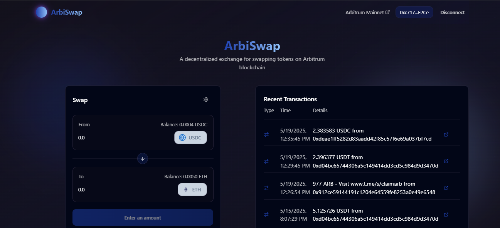

# 🦄 ArbiSwap

## 📝 Description

ArbiSwap is a decentralized exchange (DEX) application built on the Arbitrum network. It provides a seamless interface for users to swap tokens using the Uniswap V2 protocol. The application is designed to offer efficient and cost-effective token swaps while maintaining the security and reliability of the Arbitrum network.

## 🔗 Links

- **Live Demo**: [ArbiSwap DEX](https://arbiswap-lovat.vercel.app/)
- **Smart Contract**: [Arbiscan](https://arbiscan.io/address/0xe2fb9ded633c5c5e4756faf0cb1964ced8647c39)
- **GitHub Repository**: [Source Code](https://github.com/RicardoMuchacho/arbiswap-web3)

## 🚀 Process

### Smart Contract Development
1. **Development**: Created the swapApp smart contract with solidity
2. **Initial Setup**: Deployed and tested smart contracts on Arbitrum network using Foundry
3. **Protocol Integration**: Implemented Uniswap V2 router for token and ETH swaps
4. **Testing**: Comprehensive testing of each function through Metamask and Arbiscan interface

### Frontend Development
1. **Foundation**: Created initial UI using Lovable AI for rapid prototyping
2. **Wallet Integration**: Implemented RainbowKit for seamless wallet connections
3. **Smart Contract Integration**: Connected frontend with deployed contracts using wagmi and viem
4. **UI/UX Refinement**: Iterative improvements to enhance user experience
5. **Performance Optimization**: Code efficiency improvements in each iteration

## ✨ Features

### Current Features
- Token Swapping on Arbitrum Network
  - ETH to Token swaps
  - Token to Token swaps
  - Token to ETH swaps
- Real-time Transaction History
- Multi-wallet Support via RainbowKit
- Support for ETH and Major Stablecoins
- Secure Smart Contract Integration

### Planned Features
- Extended Token Support
  - Integration with more ERC-20 tokens
  - Custom token lists
- Liquidity Pool Management
  - Add/Remove liquidity
  - Pool analytics
- Fee Management System
  - Custom fee settings
  - Fee distribution
- Optimized Transactions
  - Single-click approve + swap
  - Gas optimization

## 🛠️ Technologies

- **Frontend**:
  - React
  - TypeScript
  - Tailwind CSS
  - Shadcn UI
  - Wagmi/Viem (interact with blockchain)
  - Rainbowkit (wallet connection)

- **Smart Contracts**:
  - Solidity ^0.8.24
  - OpenZeppelin Contracts
  - Forge (Foundry)

- **Network**:
  - Arbitrum
  - Uniswap V2 Protocol
  - Alchemy (api)

## 📄 Contracts

The main contract `SwapApp` provides the following functionality:

| Function | Description |
|----------|-------------|
| `swapTokens` | Swaps exact tokens for tokens using the Uniswap V2 router |
| `swapETHForTokens` | Swaps exact ETH for tokens using the Uniswap V2 router |
| `swapTokensForETH` | Swaps exact tokens for ETH using the Uniswap V2 router |

### Contract Address
- **SwapApp**: `0xe2fb9DeD633C5c5e4756FaF0Cb1964CeD8647C39`
- **Router**: `0x4752ba5DBc23f44D87826276BF6Fd6b1C372aD24`
- **Factory**: `0xF62c03E08ada871A0bEb309762E260a7a6a880E6`